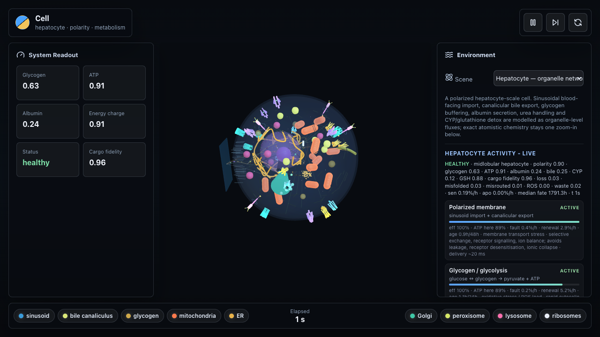

# Cell

> A source-grounded, real-units **stochastic simulation of a hepatocyte (liver cell)** — reaching from single molecules to tissue, checked against measured biology rather than tuned to look right.



**Contents:** [What It Is Now](#what-it-is-now) · [Run The Prototype](#run-the-prototype) · [Verify](#verify) · [Current Target Cell Type](#current-target-cell-type) · [Status — honest accounting](#status--honest-accounting) · [Documentation Map](#documentation-map)

A research-first, source-grounded simulation of a **hepatocyte (liver cell)**,
built the way the whole-cell modelling field builds them: a stochastic, real-units
biochemical engine, validated against measured data, with an interactive 3-D scene
on top.

The project began as a bottom-up "atom → molecule → membrane → cell" experiment.
That proved computationally unrealistic on consumer hardware (as it is for every
serious effort), so the work pivoted to the **cell scale** — exactly where E-Cell,
Virtual Cell, the Karr/JCVI whole-cell models, and HEPATOKIN1 operate. The old
molecular-scale pieces remain as background/zoom-in scenes, not the focus.

## What It Is Now

A running, hepatocyte-scale **stochastic kinetic cell**, in real units, that
reaches from single molecules up to tissue — and is checked against measured
biology rather than tuned to look right.

### The engine (`engine/cell_engine`)

- **Real units** — concentrations and molecule counts tied to a grounded
  hepatocyte volume; every species and rate carries provenance.
- **A stochastic reaction core** — exact Gillespie SSA for low-copy species and
  the chemical Langevin equation (an SDE) for high-copy species, the same hybrid
  the field's whole-cell models use, verified against analytic results (Poisson
  birth–death, binomial partitioning, Hill kinetics).

### The cell's processes (each tested, each grounded or honestly flagged)

- **Energy & carbon metabolism** — full glycolysis (literature enzyme kinetics on
  the regulated steps; the seven near-equilibrium steps treated as grounded
  thermodynamics, not invented numbers), the **pentose phosphate pathway**
  (2 NADPH per glucose-6-phosphate), and **TCA + oxidative phosphorylation**
  (P/O ratios 2.5 / 1.5, ~10 ATP per acetyl-CoA, respiratory control by ADP).
- **Nitrogen & redox** — the **urea cycle** and the **glutathione/NADPH** couple,
  with exact conservation laws.
- **Gene expression** — stochastic gene → mRNA → protein with a **two-state
  promoter**, reproducing transcriptional bursting (super-Poissonian mRNA).
- **Hormonal signalling** — insulin / glucagon / AMPK switching glycogen storage
  vs mobilisation (fed vs fasted).
- **Membrane transport** — polarized vectorial flux through real transporters
  (GLUT2, NTCP, OATP, Na⁺/K⁺-ATPase, BSEP, MRP2); a BSEP defect reproduces
  cholestasis.
- **Calcium signalling** — IP₃R-mediated cytosolic Ca²⁺ **oscillations** whose
  frequency rises with agonist (Goldbeter 1990).
- **Lipid metabolism** — de novo lipogenesis, β-oxidation and VLDL secretion;
  steatosis emerges when synthesis outpaces export.
- **Secretion** — constitutive albumin trafficking with measured ER→Golgi→blood
  transit times (~30 min).
- **DNA damage & repair** — stochastic double-strand-break repair with a p53
  fate decision keyed to the DSB burden (~30 DSB/Gy).
- **Life and death** — cell-cycle states, biomass growth, division (binomial
  partitioning of real molecule counts), cancer-like loss of checkpoint control,
  and a **death decision that distinguishes apoptosis from necrosis** via the ATP
  switch (Leist/Eguchi 1997).
- **A unified whole cell** — metabolism + expression + cycle composed into one
  network that lives, grows, expresses, divides, or arrests when starved.
- **Host–pathogen & tissue** — a viral infection that hijacks host resources, and
  a multicellular tissue where coupled hepatocytes clear ammonia collectively and
  suffer **dose-dependent drug injury** (paracetamol overdose → centrilobular-style
  necrosis as cells die).
- **Spatial reaction–diffusion** — the real reaction network run on a voxel grid
  with grounded cytoplasmic diffusion coefficients; reproduces the analytic
  morphogen gradient `λ = √(D/k)` and mitochondrial ATP microdomains.

### Validation & calibration

Emergent outputs are checked against measured hepatocyte values — energy charge,
steady-state ATP, ATP:ADP, glucokinase glucose-sensing (S₀.₅ ≈ 8 mM), and the
GSH:GSSG redox ratio — **all within the measured physiological range**. A
calibration routine fits placeholder constants to measured targets and records
them as *fitted* rather than guessed. The full engine suite is covered by unit
tests and should be re-run after every biology change.

### The browser scene (TypeScript + Three.js)

A polarized hepatocyte with a **fenestrated sinusoidal endothelium** (sieve-plate
pores, LSEC nuclei), a canalicular bile groove, true-size membrane-protein
footprints, and blood-side cargo crossing the endothelium through many fenestrae.
The scene only ever shows the engine's state — it never fakes biology.

This is **not** a predictive digital twin, and it does not pretend to be. It is an
early-stage, source-grounded model whose architecture is now field-aligned and
whose individual behaviours are tested. Coverage is still a fraction of a real
hepatocyte and some rate constants are still provisional — every such value is
flagged as an assumption, never dressed up as measured. See the honest accounting
under "Status".

## Run The Prototype

```bash
npm install
npm run dev
```

Then open the local URL printed by Vite. The app starts on the **hepatocyte
organelle scene**: a whole cell with nucleus, mitochondria, ER, Golgi,
lysosome/endosome, peroxisome, ribosomes, glycogen granules, plasma-membrane
transport proteins, a sinusoidal blood-facing vessel, and a canalicular bile
groove.

Below it, **legacy zoom-in scenes** from the original molecular-scale phase are
kept as background: the lipid vesicle, ion, water (SPC/E), solvation, diffusion,
membrane, and chemistry building blocks. These are no longer the project's focus —
the science now lives in the cell-scale stochastic engine — but they remain
source-grounded and are useful for intuition. See
[docs/06-one-reality.md](docs/06-one-reality.md) and
[docs/sources.md](docs/sources.md).

## Verify

```bash
npm test
npm run build
python -m unittest discover -s engine/tests -t engine
```

To print the validation scorecard (model vs measured hepatocyte data):

```bash
PYTHONPATH=engine python -c "from cell_engine.stochastic.validation import run_validation, format_report; print(format_report(run_validation()))"
```

> The engine targets Python 3.11+ (it uses `datetime.UTC`).

## Current Target Cell Type

The target is **hepatocyte-first**, not a generic animal cell — the choice that
lets the model be specific and checkable. The work is organised around hepatocyte
metabolism, detox, secretion, sinusoidal/canalicular polarity, bile handling, the
urea cycle, redox defence, and state-conditioned life-and-death decisions. The
near-term plan and its literature foundation live in the
[depth roadmap](docs/08-depth-roadmap-and-literature.md); the architecture and
language split are in the
[integrated engine roadmap](docs/07-integrated-cell-engine-roadmap.md).

Why a liver cell? It runs an unusually broad slice of human biochemistry — glucose
storage and output, the urea cycle (almost unique to hepatocytes), CYP detox,
bile export, lipid handling, plasma-protein secretion — so a faithful hepatocyte
exercises most of what a "real cell" engine needs, and its pathologies (steatosis,
cholestasis, paracetamol injury) give concrete, measurable targets to validate
against.

## Status — honest accounting

The single most important rule of this project: **nothing is faked.** Every
constant is either measured (with a citation), a justified modelling assumption
(named as such — e.g. "near-equilibrium step, rate non-flux-determining"), or an
explicitly flagged placeholder. No number is ever dressed up as real biology.

What is real now: the engine does the *right kind* of thing the field does
(hybrid stochastic kinetics in real units); the metabolic core (glycolysis, PPP,
TCA/OXPHOS, urea, redox) is grounded in literature stoichiometry and kinetics; a
broad set of cell processes is implemented and tested; and a handful of emergent
behaviours are **validated** against measured hepatocyte data (all current targets
in range). The division module now separates compressed demo timing from
source-traced biological timing profiles, including a rat post-partial-
hepatectomy profile that blocks fast G1/S entry.

What is still depth-work (the road ahead is depth, not a new approach):

- some newer modules (membrane transport, hormonal signalling, lipid handling)
  still carry **illustrative** rate constants — the mechanism is grounded, the
  magnitudes are flagged, and they are being replaced with literature kinetics
  module by module;
- coverage is still a fraction of a hepatocyte (HEPATOKIN1-level coverage is
  hundreds of grounded reactions; genome-scale models thousands);
- validation is a handful of checkpoints, not a broad comparison against
  metabolomics / fluxomics / perturbation data;
- the spatial layer is 1-D and deterministic (the field standard is 3-D stochastic
  RDME) and is not yet fused with the whole-cell network;
- volume dynamics at division and quantitative CDK/cyclin/p53 kinetics are not
  yet modelled; the current checkpoint layer is qualitative and source-traced,
  with real-time phase anchors available separately from the accelerated browser
  demo.

This is an open-ended research programme, not a checklist with an end. The
direction and the next steps are tracked in the depth roadmap
([docs/08-depth-roadmap-and-literature.md](docs/08-depth-roadmap-and-literature.md)),
which also holds the literature foundation for everything above.

The earlier epithelial notes (inside vs outside; apical vs basolateral;
transcellular/paracellular transport; tight/adherens junctions, desmosomes, basal
lamina) remain useful background for polarity and barrier thinking.

## Documentation Map

- [Project charter](docs/00-project-charter.md)
- [Research index](docs/01-research-index.md)
- [Multiscale architecture](docs/02-multiscale-architecture.md)
- [Platform recommendation](docs/03-platform-recommendation.md)
- [Integrated cell engine roadmap](docs/07-integrated-cell-engine-roadmap.md)
- [Depth roadmap & literature foundation](docs/08-depth-roadmap-and-literature.md)
- [Hepatocyte division roadmap](docs/09-hepatocyte-division-roadmap.md)
- [Atomic foundations](docs/research/physics/atomic-foundations.md)
- [Epithelial cell starting scope](docs/research/biology/epithelial-cell.md)
- [Input/output registry](docs/research/biology/input-output-registry.md)
- [Milestone 001: two-ion formation](docs/milestones/001-two-ion-formation.md)
- [Milestone 002: many-ion system](docs/milestones/002-many-ion-system.md)
- [Milestone 003: real water (SPC/E)](docs/milestones/003-water-model.md)
- [Milestone 004: solvation (ions in water)](docs/milestones/004-solvation.md)
- [Milestone 005: diffusion & Brownian motion](docs/milestones/005-diffusion.md)
- [Milestone 006: lipid membrane](docs/milestones/006-lipid-membrane.md)
- [Milestone 007: membrane transport](docs/milestones/007-membrane-transport.md)
- [Milestone 008: the closed cell (vesicle)](docs/milestones/008-closed-cell.md)
- [Milestone 009: chemistry (reaction–diffusion)](docs/milestones/009-chemistry.md)
- [Milestone 010: the eukaryotic cell (organelles)](docs/milestones/010-eukaryotic-cell.md)
- [Milestone 011: the living cell (metabolism)](docs/milestones/011-living-cell.md)
- [Milestone 012: the organelle network (parallel loops)](docs/milestones/012-organelle-network.md)
- [Milestone 013: the imperfect, spatial cell (own loops, transport, faults, live report)](docs/milestones/013-imperfect-spatial-cell.md)
- [Milestone 015: Python engine skeleton](docs/milestones/015-python-engine-skeleton.md)
- [Milestone 016: Organelle module interface](docs/milestones/016-organelle-module-interface.md)
- [Milestone 017: Cargo routing engine](docs/milestones/017-cargo-routing-engine.md)
- [Milestone 018: Hepatocyte metabolism v1](docs/milestones/018-hepatocyte-metabolism-v1.md)
- [Milestone 019: SBML/libRoadRunner bridge](docs/milestones/019-sbml-roadrunner-bridge.md)
- [Milestone 020: Rule-based signaling](docs/milestones/020-rule-based-signaling.md)
- [Milestone 021: Brian2 membrane/Ca module](docs/milestones/021-brian2-membrane-calcium.md)
- [Milestone 022: TS external snapshot mode](docs/milestones/022-ts-external-snapshot-mode.md)
- [Milestone 023: Validation harness](docs/milestones/023-validation-harness.md)
- [Milestone 024: PhysiCell bridge](docs/milestones/024-physicell-bridge.md)
- [Milestone 025: ML calibration and policy environment](docs/milestones/025-ml-calibration-policy-env.md)
- [Milestone 026: Organelle functional cycles](docs/milestones/026-organelle-functional-cycles.md)
- [Milestone 027: Engine-driven visual bridge](docs/milestones/027-engine-driven-visual-bridge.md)
- [Milestone 028: Visual time-scale disclosure](docs/milestones/028-visual-time-scale.md)
- [Milestone 029: Membrane protein visual reality](docs/milestones/029-membrane-protein-visual-reality.md)
- [Milestone 030: Real-units / copy-number foundation](docs/milestones/030-real-units-foundation.md)
- [Milestone 031: Stochastic reaction core (SSA + CLE)](docs/milestones/031-stochastic-reaction-core.md)
- [Milestone 032: Binding real units into a running cell model](docs/milestones/032-real-units-engine-binding.md)
- [Milestone 033: Full glycolysis with real per-enzyme kinetics](docs/milestones/033-glycolysis-real-kinetics.md)
- [Milestone 034: Central dogma (gene → mRNA → protein)](docs/milestones/034-central-dogma.md)
- [Milestone 035: Scaling scope by integration (expression-coupled metabolism)](docs/milestones/035-expression-coupled-scope.md)
- [Milestone 036: Cell states, growth, division, and cancer](docs/milestones/036-cell-cycle-division-cancer.md)
- [Milestone 037: Validation against measured hepatocyte data](docs/milestones/037-validation-against-measured-data.md)
- [Milestone 038: Coverage — urea cycle + glutathione redox](docs/milestones/038-coverage-urea-redox.md)
- [Milestone 039: Integration — the unified whole cell](docs/milestones/039-whole-cell-integration.md)
- [Milestone 040: Spatial reaction–diffusion](docs/milestones/040-spatial-reaction-diffusion.md)
- [Milestone 041: Calibration / ML layer (placeholder → fitted)](docs/milestones/041-calibration-ml-layer.md)
- [Milestone 042: Host–pathogen — viral infection](docs/milestones/042-host-pathogen-virus.md)
- [Milestone 043: Multicellular tissue (coupled hepatocytes)](docs/milestones/043-multicellular-tissue.md)
- [Milestone 044: Xenobiotic detox (CYP450) and drug toxicity](docs/milestones/044-xenobiotic-detox-toxicity.md)
- [Milestone 045: Apoptosis — state-conditioned cell death](docs/milestones/045-apoptosis-cell-death.md)
- [One reality — coarse but grounded](docs/06-one-reality.md)
- [Roadmap (what's next)](docs/05-roadmap.md)
- [Source ledger](docs/sources.md)


## Project Rule

Every simulated object should eventually have:

- a source-backed description
- a scale and unit system
- inputs and outputs
- relations to existing objects
- equations or rules of motion when known
- visual representation and hidden state representation
- confidence level and assumptions

## License

Released under the [MIT License](LICENSE) — free to use, study, modify, and
build on, including commercially, with attribution.
