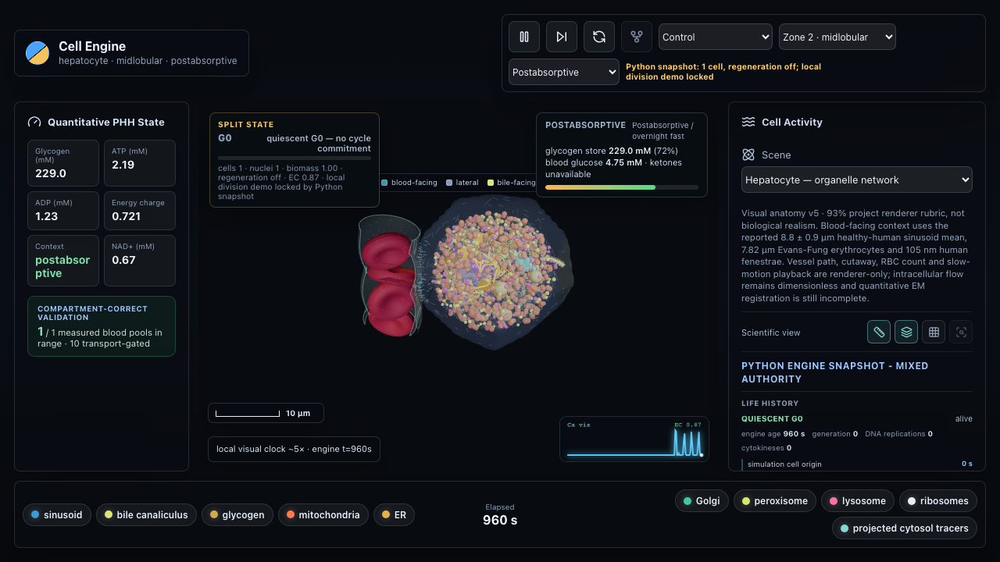

# Cell

> An evidence-gated **hepatocyte research-software prototype** combining source-preserved observations, verified numerical kernels, explicitly exploratory cell fixtures, and an interactive 3-D scene. It is not yet a predictive digital twin.



*Live browser capture of the current `Hepatocyte - organelle network` scene; this
is renderer output from the running application, not concept art.*

**Contents:** [What It Is Now](#what-it-is-now) · [Run The Prototype](#run-the-prototype) · [Verify](#verify) · [Current Target Cell Type](#current-target-cell-type) · [Status — honest accounting](#status--honest-accounting) · [Documentation Map](#documentation-map)

A research-first platform for building a **hepatocyte (liver-cell) digital twin**.
It keeps biological observations, numerical software validation, exploratory
models, and predictive authority as separate machine-checked layers, with an
interactive 3-D scene on top. The current release provides substantial research
infrastructure; it does not claim a quantitatively validated whole cell.

The project began as a bottom-up "atom → molecule → membrane → cell" experiment.
That proved computationally unrealistic on consumer hardware (as it is for every
serious effort), so the work pivoted to the **cell scale** — exactly where E-Cell,
Virtual Cell, the Karr/JCVI whole-cell models, and HEPATOKIN1 operate. The old
molecular-scale pieces remain as background/zoom-in scenes, not the focus.

## What It Is Now

A running hepatocyte-oriented research prototype spanning molecular references,
single-cell software fixtures, spatial mechanics kernels, and tissue-oriented
interfaces. Human measurements retain their original units, denominators, assay
contexts, and provenance. Only explicitly authorized data may become active
single-cell state; much of the current dynamic cell remains exploratory.

### The engine (`engine/cell_engine`)

- **Unit-aware evidence surfaces** — human observations retain their reported
  units and denominators. Geometry references, whole-liver context, per-nucleus
  proteomics, and assay outputs are not silently converted into one-cell pools.
  The legacy normalized runtime is explicitly exploratory.
- **A reaction-authority firewall** — pathway topology and numerical rates are
  audited separately. The current integrated fuel network is honestly exposed
  as `0 / 36` source-backed reaction parameterizations: two ATP-turnover rates
  are explicit placeholders and the other 34 channels are unparameterized. All
  may run only as an exploratory model and cannot drive quantitative validation.
- **An equation-level kinetic-transfer firewall** — all 36 active reactions are
  mapped against the pinned Koenig human hepatic-glucose SBML. Twelve have
  related candidates and three share exact aliased stoichiometry, but zero pass
  the full MathML, compartment, per-cell-unit, PHH-context, and validation gates;
  therefore zero fitted publication parameters are imported.
- **A typed reaction-evidence data plane** — a strict 45-column intake maps
  source records to the active network's `36 x 12 = 432` evidence slots while
  checking reaction identity, context, units, donor/study separation and frozen
  held-out artifacts. No delivery is currently loaded and structural coverage
  cannot activate a rate.
- **Donor-matched protein and signal-chain data planes** — a 48-column
  receptor/signaling intake covers eight stages across all eight communication
  pathways, while a 52-column localization/activity intake covers 63 slots for
  BSEP, MRP2, NTCP, INSR, MET, EGFR, GLUT2, and glucokinase. Both currently
  contain zero delivered records and grant zero automatic runtime authority.
- **A donor-resolved PHH mechanics data plane** — a strict 48-column intake
  preserves raw loading, hold, relaxation and washout observations separately
  from source-reported constitutive parameters. Canonical units, raw-artifact
  checksums, same-cell mesh identity, spatial boundary conditions and
  donor/study-disjoint held-out data are required; zero mechanics trajectories
  or parameters are currently authorized.
- **Two-way intracellular boundary mechanics** — stochastic organelle motion is
  constrained against the current membrane triangles and queues the opposite
  dimensionless membrane load; the cut-cell cytosol pressure field also queues
  mean-removed dimensionless traction. The live surface preserves volume,
  winding and the conservative one-percent engineering area guard. Newtons,
  pascals and healthy-PHH sustainability thresholds remain null until the
  donor-resolved mechanics gate is satisfied.
- **An organelle-geometry and instance firewall** — 1,901 stable discrete-body
  identities remain available for collision, rendering, and future longitudinal
  data. Their inventory combines an aggregate human cell volume with
  predominantly rat stereology; coordinates are seeded, not measured. The
  scaffold therefore has zero healthy-PHH count, volume-fraction, distribution,
  mesh, or quantitative-contact authority. All unmeasured vitality, age,
  recovery, turnover, and clearance fields remain null.
- **A verified constraint-model software layer** — the checksum-pinned 43 MB
  Human-GEM v2.0.0 SBML/FBC artifact now streams into an exact sparse model
  representation with 55,198 stoichiometric terms, bounds, the generic biomass
  objective and Boolean gene-product rules. Source-defined FASTCC classifies
  11,641 reactions as flux-consistent and 1,290 as blocked at the explicit
  numerical threshold `1e-4`; the model's own generic biomass objective also
  solves with pinned sparse numerics. Five analytic FBA/FVA fixtures and a
  synthetic FASTCORE extraction fixture remain as software checks. The
  healthy-PHH core set, measured exchange bounds, PHH objective, scale operator
  and independent validation remain absent, so no PHH optimization or runtime
  flux coupling is enabled.
- **A checksum-bound browser context matrix** — one canonical engine snapshot
  and 40 exact overlays cover all selectable zonation, nutrition and experiment
  contexts. Offline export verifies exact reconstruction, while the runtime
  rejects stale bases and state-surface drift. This reduces checked-in context
  artifact bytes by 84.9% without changing any biological parameter.
- **A tested first-render bundle boundary** — the snapshot interpreter, PDB
  parser and bloom modules are deferred behind the first scene, while Three.js
  core is separately cacheable. The production manifest gate keeps initial
  JavaScript below explicit raw/gzip budgets and fails if deferred modules drift
  back into the startup graph.
- **A browser runtime workload policy** — hidden tabs and offscreen cell
  viewports suspend rendering, the dimensionless cytosol field advances on a
  tested quality-tier cadence, and total frame work can lower quality without
  changing the Python engine or any biological parameter. The normalized cell
  fixture is now an isolated software-test object and is absent from production
  runtime execution. A missing Python snapshot produces neutral anatomy and an
  explicit unavailable state, never substitute biochemistry, fate, transport,
  division probability or daughter cells. Independent renderer motion continues
  on wall-clock time and carries no biological timing authority.
- **A complete engineering-to-evidence handoff** — all 23 scopes currently
  marked `partial` or `blocked_missing_evidence` map to one or more of 16
  checksum-pinned, fail-closed intake contracts. A dedicated three-table bundle
  now covers PHH p53/MDM2 trajectories, clonal population dynamics, and all 44
  quantitative capability-atlas slots. The machine audit reports zero
  unclassified code-only scopes, while keeping scientific completion,
  biological validation, predictive digital-twin authority, and biological
  accuracy explicitly false or null.
- **A durable living-run archive** — one transactional SQLite file can preserve
  complete cell-state plus RNG checkpoints, unit-explicit external-input
  declarations and read-only observations in an append-only SHA-256 chain.
  Runs resume bit-identically after interruption and fork from an audited
  checkpoint for counterfactual continuations. The archive accepts only the
  schematic or exploratory whole-cell purposes; persistence grants no PHH,
  biological-validation or predictive authority.
- **A fail-closed human lifecycle baseline** — the quiescent human hepatocyte no
  longer inherits rat cell-cycle or mouse regeneration timing metadata. Missing
  healthy-human phase durations are omitted, marked non-executable and cannot
  advance the cycle; cross-species timing profiles remain explicit opt-in
  benchmarks only.
- **A stochastic reaction core** — exact Gillespie SSA for low-copy species and
  the chemical Langevin equation for high-copy species, verified against analytic
  software fixtures such as Poisson birth-death and binomial partitioning. This
  validates the numerical implementation, not the current PHH parameterization.

### The cell's processes (software-tested and authority-labelled)

- **Energy & carbon metabolism** — glycolysis, pentose-phosphate, TCA and
  oxidative-phosphorylation topology with explicit reaction authority. The new
  energy/redox contract separates 38 ATP, adenylate, nicotinamide, glutathione,
  oxygen and ROS pools across six compartments and 14 process systems. All
  unmeasured organelle values and rates remain null. A 47-column trajectory
  intake now requires donor-resolved, compartment-targeted, calibrated PHH time
  series with oxygen context and sealed held-out data before those nulls can
  even be considered for review.
- **Nitrogen & redox** — the **urea cycle** and the **glutathione/NADPH** couple,
  with software conservation tests. Legacy glutathione and OXPHOS kinetics are
  explicitly placeholder fixtures, not healthy-PHH predictions.
- **Gene-expression software fixture** — stochastic gene → mRNA → protein with a
  two-state promoter reproduces the expected super-Poissonian bursting pattern.
  Healthy-PHH locus-specific rates and future-state coupling are not identified.
- **Human endocrine context** — measured healthy-human mixed-meal plasma glucose,
  insulin and glucagon plus tracer-derived hepatic-output observations and a
  causal glucagon-clamp glycogen benchmark. Legacy normalized hormone switches
  remain schematic; portal exposure, receptor activity and hormone-to-rate
  coupling fail closed.
- **Human validation protocol** — 19 reported mixed-meal observations retained as
  exact points, windows or summary parameters. Separate cohorts are not matched,
  no time point is interpolated, and comparisons require the same unit, timing
  and biological scale.
- **Exact PHH spheroid protocol** — the Kemas 2021 3D-PHH experiment is locked as
  12 non-overlapping cumulative-mean targets plus four descriptive overlap
  audits. Wrong scale, denominator, unit, hormone bundle or time window fails
  closed; unreported medium-volume, covariance and tracer details remain null.
- **External evidence intake** — a nine-file, checksum-audited delivery contract
  rejects ambiguous missing values, malformed provenance and model outputs
  labelled as measurements. Even valid deliveries require manual primary-source
  review before any parameter can be activated.
- **Unified evidence readiness** — 16 registered validators cover every one of
  the 23 evidence-gated completion scopes. Missing or malformed deliveries
  remain visible and quarantined. A separate two-person review registry binds
  decisions to exact delivery, contract, and review-artifact hashes; a CSV's
  self-declared `verified` field grants no scientific credit, and review still
  cannot activate parameters, state coupling, or prediction.
- **Published-model external check** — the postabsorptive shadow predicts
  10.02 umol glucose/kg/min production versus a unit-normalized healthy-human
  tracer estimate of 10.55 +/- 0.22. The -5.0% contextual residual is reported
  without a pass claim because boundaries, timing, donors and data independence
  are not matched.
- **Membrane-transport topology fixture** — polarized channels use the biological
  identities GLUT2, NTCP, OATP, Na+/K+-ATPase, BSEP, and MRP2. Current loss-of-
  function scenarios are qualitative; no active surface-copy, calibrated flux,
  or predictive cholestasis claim is made.
- **Calcium-signalling fixture** — a cross-context Goldbeter-style IP3R model
  produces agonist-dependent oscillations, without healthy-PHH kinetic authority.
- **Lipid-metabolism fixture** — de novo lipogenesis, beta-oxidation, and VLDL
  topology are represented with relative pools. Steatosis-like states are
  exploratory outcomes, not calibrated predictions.
- **Albumin secretion** - six commercial PHH batch endpoints are represented in
  the exact 24 h ELISA unit. ER, Golgi, exocytosis and degradation rates remain
  blocked because the available PHH assay does not resolve them.
- **PHH functional quality panel** - 72 batch-resolved CYP SCR/MFR observations,
  five d8-TCA BEI values, six-batch FACS identity markers, and 54,134 filtered
  single-cell transcriptomes are available as assay-matched validation surfaces.
  Product criteria and censored records never become simulation thresholds or
  biological zeros.
- **DNA damage & repair** - a schematic stochastic DSB layer and a reduced
  p53/MDM2 candidate exist for software and exploratory work. The p53 candidate
  is not PHH-calibrated, executes no canonical fate panel, and cannot drive
  quantitative validation, prediction, or authoritative cell state.
- **Life and death** - cell-cycle, biomass, count-partitioning and death-state
  software substrates exist. Their legacy thresholds remain schematic; the
  project makes no current healthy-PHH cancer-transition or treatment claim.
- **A unified exploratory cell** — metabolism, expression, and lifecycle software
  fixtures are composed into one normalized network. Its growth, arrest,
  division, and death outcomes are not biological predictions.
- **Host-pathogen and tissue fixtures** — legacy viral-infection and coupled-cell
  demonstrations exercise future interfaces. Their infection, ammonia-clearance,
  APAP-injury, and necrosis outcomes are qualitative software scenarios only.
- **Spatial reaction–diffusion numerics** — tested voxel diffusion, no-flux mass
  conservation and analytic `λ = √(D/k)` behaviour. The numerical kernels are
  not labelled as glucose, ATP or another PHH species until species-specific
  transport and validation evidence passes the quantitative gate.

### Validation & calibration

Validation is assay-specific and fail-closed. The former broad ATP/redox
"100% accuracy" score has been retired because its outputs came from calibrated
software fixtures and unmatched aggregate ranges. The remaining glucokinase
S₀.₅ check verifies implementation of the same sourced equation; it is not an
independent biological validation. Separate gates expose exactly which PHH
observations can be compared, fitted or held out, and currently activate zero
energy/redox kinetic parameters.

External review is now claim-specific rather than percentage-based. Four
contexts of use, ten scoped claims, six reviewer roles and four ordered review
rounds are exported as a machine-readable contract and human review dossier.
The current record contains zero external domain-review results, zero
same-assay validated claims, zero prospective PHH results and zero independent
reproductions; whole-cell biological accuracy therefore remains unidentifiable.

### The browser scene (TypeScript + Three.js)

A polarized hepatocyte scene with a **fenestrated sinusoidal endothelium**
(sieve-plate pores and LSEC nuclei), a canalicular bile groove, visibility-
magnified deposited protein structures, and schematic blood-side cargo. The
scene combines source-bound scale references, engine runtime geometry proxies,
and clearly labelled visual samples; it is not a microscopy reconstruction.

Recent additions make more of the engine visible and keep it physically honest:

- **The central dogma, animated.** Inside the interphase nucleus, schematic gene
  loci mirror engine events and mRNA tracers move through a nuclear-pore route.
  Their movement cadence is wall-clock renderer staging, not a measured PHH
  transcription, export, or transport trajectory.
- **Explicit nutritional contexts.** Fed peak, postabsorptive and prolonged-fast
  selections load source-backed liver-glycogen references. Blood glucose,
  insulin, glucagon and ketones appear only where the selected profile has a
  compatible measurement; unavailable boundaries remain visibly unavailable.
- **An intrinsic fluid membrane on every hepatocyte.** Each engine hepatocyte
  carries its own fluid-bilayer material contract. The visible membrane is one
  Eulerian deformable mesh, while lipids, microvilli and membrane proteins use
  surface coordinates so they remain attached as the mesh bends; there is no
  second static shell or product-level second-cell demonstration.
- **Topology-preserving surface refinement.** A separate adaptive edge-bisection
  kernel preserves a closed two-manifold's winding, Euler characteristic, area,
  volume, vertex/face state and exact barycentric protein/lipid positions. An
  explicit bridge now transfers live rest geometry and velocity, then rebuilds
  all `MembraneSim` topology caches. It has no automatic threshold and is not an
  endocytosis, fission or fusion model.
- **Fractional intracellular boundaries.** Thin ER, canalicular and Golgi
  barriers contribute analytic open-face fractions to the dimensionless
  pressure and passive-transport solvers. Partial-cell scalar volume and moving
  boundary remaps conserve numerical mass; this remains a numerical test bed,
  not healthy-PHH CFD or a measured organelle mesh.
- **Mechanics and genome-scale execution are visible but fail closed.** The
  browser reports the mechanics trajectory/parameter queue, exact generic
  Human-GEM sparse loading, FASTCC classification, generic native-objective
  solve, analytic FBA/FVA and FASTCORE self-tests, and PHH execution-bundle
  requirements. These are engineering readiness indicators, not biological
  completion or inferred hepatocyte fluxes.
- **Contact deforms the main cell itself.** When an authoritative engine contact
  is present, the same high-resolution membrane shown in the browser compresses
  along the contact normal and expands tangentially with exact affine volume
  preservation. Local membrane proteins are gated by patch overlap, partner,
  orientation and pathway state. Membrane evidence and interaction state live
  inside the single **Hepatocyte - organelle network** scene; there is no
  separate communication hepatocyte. A future explicit cell, bacterium or virus
  is placed in this same coordinate system, and contact is highlighted only
  when the engine supplies its patch polygon. The default export remains a
  single cell, and
  its silhouette does not perform an invented whole-cell wobble in the absence
  of a load. The current `1%` mesh-area cap is labelled only as a conservative
  engineering guard, not as a healthy-PHH material measurement; PHH membrane
  tension, bending modulus, cortex adhesion and rupture strain remain null.

**Quantitative concentration fields are currently gated off.** The former
glucose/ATP browser fields were retired because their millimolar values depended
on order-of-magnitude coefficients rather than a complete healthy-PHH evidence
and validation package. `scripts/export_concentration_field.py` now has no
biological defaults and no public output path. A future field must carry
parameter-level provenance, held-out same-context validation and independent
review authorization before the renderer can expose it.

This is **not** a predictive digital twin. It is an early-stage, evidence-gated
research platform whose numerical kernels and individual contracts are tested.
Coverage is still a fraction of a real hepatocyte. Exploratory or cross-context
numbers are kept behind explicit scientific gates and cannot authorize a
quantitative PHH claim. See the honest accounting under "Status".

## Run The Prototype

```bash
npm install
npm run dev
```

Then open the local URL printed by Vite. The app starts on the **hepatocyte
organelle scene**: a whole cell with nucleus, mitochondria, ER, Golgi,
lysosome/endosome, peroxisome, ribosomes, glycogen granules, plasma-membrane
transport-protein structure references, a sinusoidal blood-facing environment,
and a canalicular bile groove. Internal discrete organelles are a mixed-species
runtime geometry proxy, not measured healthy-PHH counts or coordinates.

Below it, **legacy zoom-in scenes** from the original molecular-scale phase are
kept as background: the lipid vesicle, ion, water (SPC/E), solvation, diffusion,
membrane, and chemistry building blocks. These are no longer the project's focus —
the science now lives in the cell-scale stochastic engine — but they remain
individually scoped by their own assumptions and are useful for intuition. See
[docs/06-one-reality.md](docs/06-one-reality.md) and
[docs/sources.md](docs/sources.md).

## Verify

```bash
npm test
npm run build
python -m unittest discover -s engine/tests -t engine
```

To print the legacy software-consistency report (not biological accuracy):

```bash
PYTHONPATH=engine python -c "from cell_engine.stochastic.validation import run_validation, format_report; print(format_report(run_validation()))"
```

> The engine targets Python 3.11+ (it uses `datetime.UTC`).

## Current Target Cell Type

The target is **hepatocyte-first**, not a generic animal cell — the choice that
lets the model be specific and checkable. The work is organised around hepatocyte
metabolism, detox, secretion, sinusoidal/canalicular polarity, bile handling, the
urea cycle, redox defence, and state-conditioned life-and-death decisions. The
near-term plan and its literature foundation live in the
[depth roadmap](docs/08-depth-roadmap-and-literature.md); the architecture and
language split are in the
[integrated engine roadmap](docs/07-integrated-cell-engine-roadmap.md).

Why a liver cell? It runs an unusually broad slice of human biochemistry — glucose
storage and output, the urea cycle (almost unique to hepatocytes), CYP detox,
bile export, lipid handling, plasma-protein secretion — so a faithful hepatocyte
exercises most of what a "real cell" engine needs, and its pathologies (steatosis,
cholestasis, paracetamol injury) give concrete, measurable targets to validate
against.

## Status — honest accounting

The central project rule is that biological authority must be explicit. Every
constant should be measured with a citation, derived transparently, or labelled
as an assumption or placeholder. Automated firewalls increasingly enforce that
rule; continuing audits may still discover legacy claims that need correction,
and those corrections are versioned rather than hidden.

What is implemented and evidence-backed now: the engine has verified stochastic
machinery, unit-aware data structures, denominator-preserved human observations,
and machine-enforced authority gates. The energy/redox layer now distinguishes
cytosol, mitochondrial intermembrane space and matrix, ER lumen and peroxisome;
it does not infer organelle concentrations or kinetics from whole-liver values.
The engine division module separates software-test timing from source-traced
biological timing profiles, including a rat post-partial-hepatectomy profile
that blocks fast G1/S entry. The production browser has no local division
button, phase clock, failure law, organelle partition or daughter-state model;
it renders daughters only from a gated engine event.

The scoped completion ledger currently contains 57 entries: 32 narrowly closed
engineering scopes, 8 partial biological capabilities, 15 scopes blocked on
context-matched evidence, 1 external-validation action, and 1 representation
that is inapplicable at whole-cell scale. Every partial or evidence-blocked scope
has an exact intake route. Therefore the software boundary reports zero work
that can responsibly advance through code alone before new evidence arrives.
This is an engineering handoff result, not completion of the hepatocyte,
scientific model, or predictive digital twin.

The dimensionless cytosol test bed now rasterizes the smooth star-shaped outer
membrane as cut-cell volume fractions and face apertures. Local membrane motion
enters the pressure projection through a discrete geometric-conservation source,
and passive scalar mass is conservatively remapped. This is verified numerical
engineering, not measured PHH CFD, pressure, viscosity, or fluid-structure
interaction.

The same numerical layer can now audit and consume generic closed triangle
meshes. A separate 41-field intake requires donor-linked microscopy geometry,
scale, frozen transforms, external self-intersection evidence and
grid-convergence evidence before any PHH mesh can be registered. Species-level
mobility/crowding and reaction-level transport coupling have their own 50- and
51-field contracts. They currently contain zero biological records and grant
zero reaction-rate authority.

Closed meshes now undergo a repository self-intersection audit in addition to
edge-topology checks. A separate grid path accepts concave, non-star-shaped
closed meshes as fluid domains, and a dimensionless pressure-traction kernel
can propose a volume-preserving, self-intersection-free membrane response while
reporting force balance and pressure work. Topology-preserving midpoint edge
bisection can also transfer surface fields and barycentric tracers without
changing area or volume. The live renderer still uses the star-shaped membrane
path. It now consumes organelle contact penalties and mean-removed cut-cell
pressure traction in dimensionless numerical units; adaptive remeshing is not
automatic, and no PHH force, pressure, compliance or failure coefficient has
been assigned.

What is still depth-work (the road ahead is depth, not a new approach):

- the composed fuel network currently has 36 reaction channels and zero fully
  source-backed numerical parameterizations. Two ATP channels are explicit
  placeholders; the remaining 34 are unparameterized. The entire network runs
  under an exploratory role and is blocked from quantitative validation;
- the published human hepatic-glucose model supplies related candidates for 12
  active reactions, but its fitted `Vmax` values are whole-model quantities on
  a per-kilogram scale. The equation-level transfer audit activates none until
  complete symbolic laws, compartments, single-cell units, matched PHH context,
  and held-out validation agree;
- coverage is still a fraction of a hepatocyte (HEPATOKIN1-level coverage is
  hundreds of grounded reactions; genome-scale models thousands);
- validation is a handful of checkpoints, not a broad comparison against
  metabolomics / fluxomics / perturbation data;
- the project has a generic 3-D voxel reaction-diffusion numerical layer, but
  the former quantitative glucose/ATP browser fields were retired. No PHH
  species is bound until species-specific mobility, reaction kinetics, and
  same-context validation pass their gates;
- volume dynamics at division and quantitative CDK/cyclin/p53 kinetics are not
  yet PHH-authorized. A cross-context p53/MDM2 ODE is retained only behind an
  explicit exploratory-purpose gate. Heldring 2022 adds 50-donor PHH transcript
  endpoints at 8 h and 24 h, but also shows that a HepG2-derived model misses the
  PHH TP53-MDM2 relationship; time-resolved PHH protein and fate data remain the
  activation requirement.

This is an open-ended research programme, not a checklist with an end. The
direction and the next steps are tracked in the depth roadmap
([docs/08-depth-roadmap-and-literature.md](docs/08-depth-roadmap-and-literature.md)),
which also holds the literature foundation for everything above.

The earlier epithelial notes (inside vs outside; apical vs basolateral;
transcellular/paracellular transport; tight/adherens junctions, desmosomes, basal
lamina) remain useful background for polarity and barrier thinking.

## Documentation Map

- [Project charter](docs/00-project-charter.md)
- [Research index](docs/01-research-index.md)
- [Multiscale architecture](docs/02-multiscale-architecture.md)
- [Platform recommendation](docs/03-platform-recommendation.md)
- [Integrated cell engine roadmap](docs/07-integrated-cell-engine-roadmap.md)
- [Depth roadmap & literature foundation](docs/08-depth-roadmap-and-literature.md)
- [Hepatocyte division roadmap](docs/09-hepatocyte-division-roadmap.md)
- [Atomic foundations](docs/research/physics/atomic-foundations.md)
- [Epithelial cell starting scope](docs/research/biology/epithelial-cell.md)
- [Input/output registry](docs/research/biology/input-output-registry.md)
- [Milestone 001: two-ion formation](docs/milestones/001-two-ion-formation.md)
- [Milestone 002: many-ion system](docs/milestones/002-many-ion-system.md)
- [Milestone 003: real water (SPC/E)](docs/milestones/003-water-model.md)
- [Milestone 004: solvation (ions in water)](docs/milestones/004-solvation.md)
- [Milestone 005: diffusion & Brownian motion](docs/milestones/005-diffusion.md)
- [Milestone 006: lipid membrane](docs/milestones/006-lipid-membrane.md)
- [Milestone 007: membrane transport](docs/milestones/007-membrane-transport.md)
- [Milestone 008: the closed cell (vesicle)](docs/milestones/008-closed-cell.md)
- [Milestone 009: chemistry (reaction–diffusion)](docs/milestones/009-chemistry.md)
- [Milestone 010: the eukaryotic cell (organelles)](docs/milestones/010-eukaryotic-cell.md)
- [Milestone 011: the living cell (metabolism)](docs/milestones/011-living-cell.md)
- [Milestone 012: the organelle network (parallel loops)](docs/milestones/012-organelle-network.md)
- [Milestone 013: the imperfect, spatial cell (own loops, transport, faults, live report)](docs/milestones/013-imperfect-spatial-cell.md)
- [Milestone 015: Python engine skeleton](docs/milestones/015-python-engine-skeleton.md)
- [Milestone 016: Organelle module interface](docs/milestones/016-organelle-module-interface.md)
- [Milestone 017: Cargo routing engine](docs/milestones/017-cargo-routing-engine.md)
- [Milestone 018: Hepatocyte metabolism v1](docs/milestones/018-hepatocyte-metabolism-v1.md)
- [Milestone 019: SBML/libRoadRunner bridge](docs/milestones/019-sbml-roadrunner-bridge.md)
- [Milestone 020: Rule-based signaling](docs/milestones/020-rule-based-signaling.md)
- [Milestone 021: Brian2 membrane/Ca module](docs/milestones/021-brian2-membrane-calcium.md)
- [Milestone 022: TS external snapshot mode](docs/milestones/022-ts-external-snapshot-mode.md)
- [Milestone 023: Validation harness](docs/milestones/023-validation-harness.md)
- [Milestone 024: PhysiCell bridge](docs/milestones/024-physicell-bridge.md)
- [Milestone 025: ML calibration and policy environment](docs/milestones/025-ml-calibration-policy-env.md)
- [Milestone 026: Organelle functional cycles](docs/milestones/026-organelle-functional-cycles.md)
- [Milestone 027: Engine-driven visual bridge](docs/milestones/027-engine-driven-visual-bridge.md)
- [Milestone 028: Visual time-scale disclosure](docs/milestones/028-visual-time-scale.md)
- [Milestone 029: Membrane protein visual reality](docs/milestones/029-membrane-protein-visual-reality.md)
- [Milestone 030: Real-units / copy-number foundation](docs/milestones/030-real-units-foundation.md)
- [Milestone 031: Stochastic reaction core (SSA + CLE)](docs/milestones/031-stochastic-reaction-core.md)
- [Milestone 032: Binding real units into a running cell model](docs/milestones/032-real-units-engine-binding.md)
- [Milestone 033: Full glycolysis with real per-enzyme kinetics](docs/milestones/033-glycolysis-real-kinetics.md)
- [Milestone 034: Central dogma (gene → mRNA → protein)](docs/milestones/034-central-dogma.md)
- [Milestone 035: Scaling scope by integration (expression-coupled metabolism)](docs/milestones/035-expression-coupled-scope.md)
- [Milestone 036: Cell states, growth, division, and cancer](docs/milestones/036-cell-cycle-division-cancer.md)
- [Milestone 037: Validation against measured hepatocyte data](docs/milestones/037-validation-against-measured-data.md)
- [Milestone 038: Coverage — urea cycle + glutathione redox](docs/milestones/038-coverage-urea-redox.md)
- [Milestone 039: Integration — the unified whole cell](docs/milestones/039-whole-cell-integration.md)
- [Milestone 040: Spatial reaction–diffusion](docs/milestones/040-spatial-reaction-diffusion.md)
- [Milestone 041: Calibration / ML layer (placeholder → fitted)](docs/milestones/041-calibration-ml-layer.md)
- [Milestone 042: Host–pathogen — viral infection](docs/milestones/042-host-pathogen-virus.md)
- [Milestone 043: Multicellular tissue (coupled hepatocytes)](docs/milestones/043-multicellular-tissue.md)
- [Milestone 044: Xenobiotic detox (CYP450) and drug toxicity](docs/milestones/044-xenobiotic-detox-toxicity.md)
- [Milestone 045: Apoptosis — state-conditioned cell death](docs/milestones/045-apoptosis-cell-death.md)
- [Milestone 046: Healthy sinusoid boundary v1](docs/milestones/046-healthy-sinusoid-boundary-v1.md)
- [Milestone 047: Scientific parameter audit](docs/milestones/047-scientific-parameter-audit.md)
- [Milestone 048: Unified PHH state v1](docs/milestones/048-unified-phh-state-v1.md)
- [Milestone 049: Human PHH zonation context v1](docs/milestones/049-human-phh-zonation-context-v1.md)
- [Milestone 050: PHH zonation + sinusoid-coupled homeostasis v2](docs/milestones/050-phh-zonation-sinusoid-homeostasis-v2.md)
- [Milestone 051: PHH zonation + sinusoid-coupled homeostasis v3](docs/milestones/051-phh-zonation-sinusoid-homeostasis-v3.md)
- [Milestone 052: Unified nutritional state v1](docs/milestones/052-unified-nutritional-state-v1.md)
- [Milestone 053: Human endocrine-glycogen coupling v1](docs/milestones/053-human-endocrine-glycogen-coupling-v1.md)
- [Milestone 054: Published hepatic glucose shadow model v1](docs/milestones/054-published-hepatic-glucose-shadow-model-v1.md)
- [Milestone 055: Published glucose model lineage audit v1](docs/milestones/055-published-glucose-model-lineage-audit-v1.md)
- [Milestone 056: Human evidence intake + validation protocol v1](docs/milestones/056-human-evidence-intake-validation-protocol-v1.md)
- [Milestone 057: Published glucose external human validation v1](docs/milestones/057-published-glucose-external-human-validation-v1.md)
- [Milestone 058: Intercellular communication + generative modeling boundary v1](docs/milestones/058-intercellular-communication-generative-modeling-boundary-v1.md)
- [Milestone 059: Healthy PHH spheroid validation v1](docs/milestones/059-healthy-phh-spheroid-validation-v1.md)
- [Milestone 060: PHH spheroid exact-protocol validation v1](docs/milestones/060-phh-spheroid-exact-protocol-validation-v1.md)
- [Milestone 061: PHH glucose measurement operator + identifiability gate v1](docs/milestones/061-phh-glucose-measurement-operator-identifiability-v1.md)
- [Milestone 062: PHH albumin secretion observability + secretory-path gate v1](docs/milestones/062-phh-albumin-secretion-observability-v1.md)
- [Milestone 063: PHH CYP450 batch-resolved function observability v1](docs/milestones/063-phh-cyp450-function-observability-v1.md)
- [Milestone 064: PHH d8-TCA biliary-excretion observability v1](docs/milestones/064-phh-biliary-excretion-observability-v1.md)
- [Milestone 065: PHH identity, purity, and heterogeneity observability v1](docs/milestones/065-phh-identity-heterogeneity-observability-v1.md)
- [Milestone 066: Absolute PHH proteome budget v1](docs/milestones/066-absolute-phh-proteome-budget-v1.md)
- [Milestone 067: Historical BSEP/MRP2 denominator bridge v1](docs/milestones/067-bsep-mrp2-transporter-inventory-v1.md)
- [Milestone 068: Human SCH endogenous bile-acid compartments v1](docs/milestones/068-human-sch-endogenous-bile-acids-v1.md)
- [Milestone 069: Source-backed hepatocyte visual anatomy v2](docs/milestones/069-source-backed-hepatocyte-visual-anatomy-v2.md)
- [Milestone 070: Geometry-authoritative spatial world v1](docs/milestones/070-geometry-authoritative-spatial-world-v1.md)
- [Milestone 071: Event-driven polyhedral contact world v2](docs/milestones/071-event-driven-polyhedral-contact-world-v2.md)
- [Milestone 072: Volume-preserving contact deformation v1](docs/milestones/072-volume-preserving-contact-deformation-v1.md)
- [Milestone 073: Intrinsic fluid hepatocyte membrane v1](docs/milestones/073-intrinsic-fluid-hepatocyte-membrane-v1.md)
- [Milestone 074: Geometry-molecular-signal-transport gates v1](docs/milestones/074-geometry-molecular-signal-transport-gates-v1.md)
- [Milestone 075: Physical integrity verification v1](docs/milestones/075-physical-integrity-verification-v1.md)
- [Milestone 076: Human liver open-data atlas v1](docs/milestones/076-human-liver-open-data-atlas-v1.md)
- [Milestone 077: Donor-resolved absolute PHH proteome v1](docs/milestones/077-donor-resolved-absolute-phh-proteome-v1.md)
- [Milestone 078: PHH protein location, kinetics, donor variation, and validation v1](docs/milestones/078-phh-protein-location-kinetics-donor-validation-v1.md)
- [Milestone 079: Human in-situ geometry and coupled transport v1](docs/milestones/079-human-in-situ-geometry-coupled-transport-v1.md)
- [Milestone 080: Human 3D hepatocyte morphometry v1](docs/milestones/080-human-3d-hepatocyte-morphometry-v1.md)
- [Milestone 081: Stochastic contact placement and scientific overlays v1](docs/milestones/081-stochastic-contact-surface-scientific-overlays-v1.md)
- [Milestone 082: Quantitative reaction authority firewall v1](docs/milestones/082-quantitative-reaction-authority-firewall-v1.md)
- [Milestone 083: Published reaction kinetic-transfer audit v1](docs/milestones/083-published-reaction-kinetic-transfer-audit-v1.md)
- [Milestone 084: Exact glucose-homeostasis subnetwork v1](docs/milestones/084-exact-glucose-homeostasis-subnetwork-v1.md)
- [Milestone 085: Glucose open system and exact assay bridge v1](docs/milestones/085-glucose-open-system-exact-assay-v1.md)
- [Milestone 086: Glucose calibration and held-out validation gate v1](docs/milestones/086-glucose-calibration-heldout-validation-gate-v1.md)
- [Milestone 087: Compartment-resolved energy and redox contract v1](docs/milestones/087-compartment-resolved-energy-redox-contract-v1.md)
- [Milestone 088: Energy/redox calibration and validation firewall v1](docs/milestones/088-energy-redox-calibration-validation-firewall-v1.md)
- [Milestone 089: External scientific review readiness v1](docs/milestones/089-external-scientific-review-readiness-v1.md)
- [Milestone 090: Hepatocyte capability and memory atlas v1](docs/milestones/090-hepatocyte-capability-memory-atlas-v1.md)
- [Milestone 091: Reaction evidence atlas v1](docs/milestones/091-reaction-evidence-atlas-v1.md)
- [Milestone 092: Cytosol transport and rheology v1](docs/milestones/092-cytosol-transport-rheology-v1.md)
- [Milestone 093: Metabolic constraint shell v1](docs/milestones/093-metabolic-constraint-shell-v1.md)
- [Milestone 094: Moving-boundary cytosol projection v1](docs/milestones/094-moving-boundary-cytosol-projection-v1.md)
- [Milestone 095: Conservative cytosol species transport v1](docs/milestones/095-conservative-cytosol-species-transport-v1.md)
- [Milestone 096: Cytosol validation and active-transport separation v1](docs/milestones/096-cytosol-validation-active-transport-separation-v1.md)
- [Milestone 097: Pinned Human-GEM and completion ledger v1](docs/milestones/097-pinned-human-gem-and-completion-ledger-v1.md)
- [Milestone 098: Quantitative concentration claim firewall v1](docs/milestones/098-quantitative-concentration-claim-firewall-v1.md)
- [Milestone 099: Conservative moving-domain remap v1](docs/milestones/099-conservative-moving-domain-remap-v1.md)
- [Milestone 100: Human-GEM structural chemistry audit v1](docs/milestones/100-human-gem-structural-chemistry-audit-v1.md)
- [Milestone 101: Provenance-strict hepatocyte quantity harvest v1](docs/milestones/101-provenance-strict-hepatocyte-quantity-harvest-v1.md)
- [Milestone 102: Exact PHH injury observation operator v1](docs/milestones/102-exact-phh-injury-observation-operator-v1.md)
- [Milestone 103: Donor-disjoint PHH injury intake v1](docs/milestones/103-donor-disjoint-phh-injury-intake-v1.md)
- [Milestone 104: Frozen PHH injury assay evaluation v1](docs/milestones/104-frozen-phh-injury-assay-evaluation-v1.md)
- [Milestone 105: Automated browser render integrity v1](docs/milestones/105-automated-browser-render-integrity-v1.md)
- [Milestone 106: Rigid organelle boundary kinematics v1](docs/milestones/106-rigid-organelle-boundary-kinematics-v1.md)
- [Milestone 107: Renderer-linked organelle fluid boundaries v1](docs/milestones/107-renderer-linked-organelle-fluid-boundaries-v1.md)
- [Milestone 108: Donor-resolved cellular-memory intake v1](docs/milestones/108-donor-resolved-cellular-memory-intake-v1.md)
- [Milestone 109: Deterministic active-cargo separation v1](docs/milestones/109-deterministic-active-cargo-separation-v1.md)
- [Milestone 110: Conservative subgrid organelle boundaries v1](docs/milestones/110-conservative-subgrid-organelle-boundaries-v1.md)
- [Milestone 111: Local star-shaped membrane-fluid boundary v1](docs/milestones/111-local-star-shaped-membrane-fluid-boundary-v1.md)
- [Milestone 112: Donor-resolved PHH active-cargo trajectory intake v1](docs/milestones/112-donor-resolved-phh-active-cargo-trajectory-intake-v1.md)
- [Milestone 113: Donor multimodal generative-data contract v1](docs/milestones/113-donor-multimodal-generative-data-contract-v1.md)
- [Milestone 114: Fractional face-aperture cytosol v1](docs/milestones/114-fractional-face-aperture-cytosol-v1.md)
- [Milestone 115: PHH reaction-evidence intake v1](docs/milestones/115-phh-reaction-evidence-intake-v1.md)
- [Milestone 116: PHH energy/redox trajectory intake v1](docs/milestones/116-phh-energy-redox-trajectory-intake-v1.md)
- [Milestone 117: Local membrane geometric conservation v1](docs/milestones/117-local-membrane-geometric-conservation-v1.md)
- [Milestone 118: PHH receptor/signaling trajectory intake v1](docs/milestones/118-phh-receptor-signaling-trajectory-intake-v1.md)
- [Milestone 119: PHH active-protein localization intake v1](docs/milestones/119-phh-active-protein-localization-intake-v1.md)
- [Milestone 120: Watertight mesh boundary intake v1](docs/milestones/120-watertight-mesh-boundary-intake-v1.md)
- [Milestone 121: Species-resolved intracellular mobility intake v1](docs/milestones/121-species-resolved-intracellular-mobility-intake-v1.md)
- [Milestone 122: Reaction transport coupling gate v1](docs/milestones/122-reaction-transport-coupling-gate-v1.md)
- [Milestone 123: Repository mesh self-intersection audit v1](docs/milestones/123-repository-mesh-self-intersection-audit-v1.md)
- [Milestone 124: Non-star-shaped closed-mesh cytosol domain v1](docs/milestones/124-non-star-shaped-closed-mesh-cytosol-domain-v1.md)
- [Milestone 125: Dimensionless pressure-membrane response v1](docs/milestones/125-dimensionless-pressure-membrane-response-v1.md)
- [Milestone 126: Donor-resolved PHH mechanics calibration intake v1](docs/milestones/126-donor-resolved-phh-mechanics-calibration-intake-v1.md)
- [Milestone 127: Generic FBA/FVA numerical kernel v1](docs/milestones/127-generic-fba-fva-numerical-kernel-v1.md)
- [Milestone 128: Healthy-PHH metabolic execution bundle v1](docs/milestones/128-healthy-phh-metabolic-execution-bundle-v1.md)
- [Milestone 129: Checksum-gated Human-GEM sparse FBC loader v1](docs/milestones/129-checksum-gated-human-gem-sparse-fbc-loader-v1.md)
- [Milestone 130: FASTCORE context-extraction numerical kernel v1](docs/milestones/130-fastcore-context-extraction-numerical-kernel-v1.md)
- [Milestone 131: Topology-preserving adaptive remeshing v1](docs/milestones/131-topology-preserving-adaptive-remeshing-v1.md)
- [Milestone 132: Source-defined FASTCC Human-GEM consistency v1](docs/milestones/132-source-defined-fastcc-human-gem-consistency-v1.md)
- [Milestone 133: Pinned Human-GEM generic sparse FBA v1](docs/milestones/133-pinned-human-gem-generic-sparse-fba-v1.md)
- [Milestone 134: Live membrane remesh cache bridge v1](docs/milestones/134-live-membrane-remesh-cache-bridge-v1.md)
- [Milestone 135: Human-GEM FBC gene labels and strict GPR evaluation v1](docs/milestones/135-human-gem-fbc-gene-label-gpr-v1.md)
- [Milestone 136: Seven-donor PHH proteome-to-GPR core evidence v1](docs/milestones/136-seven-donor-phh-proteome-gpr-core-v1.md)
- [Milestone 137: Real-scale Human-GEM FASTCORE trial v1](docs/milestones/137-real-scale-human-gem-fastcore-trial-v1.md)
- [Milestone 138: Seven-donor GPR support stability v1](docs/milestones/138-seven-donor-gpr-support-stability-v1.md)
- [Milestone 139: Human-GEM FASTCORE scaling sensitivity v1](docs/milestones/139-human-gem-fastcore-scaling-sensitivity-v1.md)
- [Milestone 140: Reaction-level PHH evidence manifest v1](docs/milestones/140-reaction-level-phh-evidence-manifest-v1.md)
- [Milestone 141: Human-GEM FASTCORE blocker diagnostics v1](docs/milestones/141-human-gem-fastcore-blocker-diagnostics-v1.md)
- [Milestone 142: Source-limited minimum-reaction support kernel v1](docs/milestones/142-source-limited-minimum-reaction-support-kernel-v1.md)
- [Milestone 143: Human-GEM source-limited support repair v1](docs/milestones/143-human-gem-source-limited-support-repair-v1.md)
- [Milestone 144: Closed membrane topology transition audit v1](docs/milestones/144-closed-membrane-topology-transition-audit-v1.md)
- [Milestone 145: Conservative membrane topology state transfer v1](docs/milestones/145-conservative-membrane-topology-state-transfer-v1.md)
- [Milestone 146: Evidence-gated membrane topology transaction v1](docs/milestones/146-evidence-gated-membrane-topology-transaction-v1.md)
- [Milestone 147: Multi-target shared reaction-support kernel v1](docs/milestones/147-multi-target-shared-reaction-support-kernel-v1.md)
- [Milestone 148: Human-GEM minimum shared support v1](docs/milestones/148-human-gem-minimum-shared-support-v1.md)
- [Milestone 149: Human-GEM support optimum enumeration v1](docs/milestones/149-human-gem-support-optimum-enumeration-v1.md)
- [Milestone 150: Human-GEM global support cardinality v1](docs/milestones/150-human-gem-global-support-cardinality-v1.md)
- [Milestone 151: Human-GEM global support counterexample v1](docs/milestones/151-human-gem-global-support-counterexample-v1.md)
- [Milestone 152: Human-GEM fixed-core completion enumeration v1](docs/milestones/152-human-gem-fixed-core-completion-enumeration-v1.md)
- [Milestone 153: Human-GEM global support identity completeness v1](docs/milestones/153-human-gem-global-support-identity-completeness-v1.md)
- [Milestone 154: Whole-cell runtime authority firewall v1](docs/milestones/154-whole-cell-runtime-authority-firewall-v1.md)
- [Milestone 155: Legacy calibration authority firewall v1](docs/milestones/155-legacy-calibration-authority-firewall-v1.md)
- [Milestone 156: Canonical context snapshot overlay matrix v1](docs/milestones/156-canonical-context-snapshot-overlay-matrix-v1.md)
- [Milestone 157: Browser first-render code splitting and budget v1](docs/milestones/157-browser-first-render-code-splitting-budget-v1.md)
- [Milestone 158: Human baseline lifecycle timing firewall v1](docs/milestones/158-human-baseline-lifecycle-timing-firewall-v1.md)
- [Milestone 159: Browser runtime workload and cadence v1](docs/milestones/159-browser-runtime-workload-cadence-v1.md)
- [Milestone 160: Scientific snapshot export recomputation firewall v1](docs/milestones/160-scientific-snapshot-export-recomputation-firewall-v1.md)
- [Milestone 161: Unified PHH evidence readiness registry v1](docs/milestones/161-unified-phh-evidence-readiness-registry-v1.md)
- [Milestone 162: Human sinusoid cutaway visual v1](docs/milestones/162-human-sinusoid-cutaway-visual-v1.md)
- [Milestone 163: Intracellular boundary mechanics v1](docs/milestones/163-intracellular-boundary-mechanics-v1.md)
- [Milestone 164: Organelle instance evidence firewall v1](docs/milestones/164-organelle-instance-evidence-firewall-v1.md)
- [Milestone 165: p53 and population authority firewall v1](docs/milestones/165-p53-population-authority-firewall-v1.md)
- [Milestone 166: Cytoplasm motion authority firewall v1](docs/milestones/166-cytoplasm-motion-authority-firewall-v1.md)
- [Milestone 167: Human-liver context denominator firewall v1](docs/milestones/167-human-liver-context-denominator-firewall-v1.md)
- [Milestone 168: Organelle geometry and public-claim firewall v1](docs/milestones/168-organelle-geometry-public-claim-firewall-v1.md)
- [Milestone 169: Browser-local fixture execution firewall v1](docs/milestones/169-browser-local-fixture-execution-firewall-v1.md)
- [Milestone 170: Dimensionless browser fixture API firewall v2](docs/milestones/170-dimensionless-browser-fixture-api-firewall-v2.md)
- [Milestone 171: Engine-only browser cell state v1](docs/milestones/171-engine-only-browser-cell-state-v1.md)
- [Milestone 172: Complete evidence handoff and software boundary v1](docs/milestones/172-complete-evidence-handoff-software-boundary-v1.md)
- [Milestone 173: Durable experiment run archive v1](docs/milestones/173-durable-experiment-run-archive-v1.md)
- [Milestone 174: Hash-bound independent evidence review gate v1](docs/milestones/174-hash-bound-independent-evidence-review-gate-v1.md)
- [Milestone 175: Four-cycle metabolic authority graph v1](docs/milestones/175-four-cycle-metabolic-authority-graph-v1.md)
- [Milestone 176: Event-driven dynamic-FBA boundary numerics v1](docs/milestones/176-event-driven-dynamic-fba-boundary-numerics-v1.md)
- [External scientific review dossier](docs/validation/external-review-dossier.md)
- [External reviewer outreach](docs/validation/expert-outreach.md)
- [One reality — coarse but grounded](docs/06-one-reality.md)
- [Roadmap (what's next)](docs/05-roadmap.md)
- [Source ledger](docs/sources.md)


## Project Rule

Every simulated object should eventually have:

- a source-backed description
- a scale and unit system
- inputs and outputs
- relations to existing objects
- equations or rules of motion when known
- visual representation and hidden state representation
- confidence level and assumptions

## License

Released under the [MIT License](LICENSE) — free to use, study, modify, and
build on, including commercially, with attribution.
